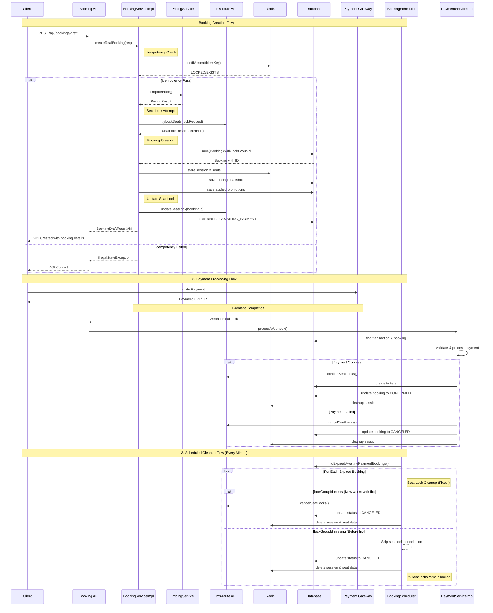
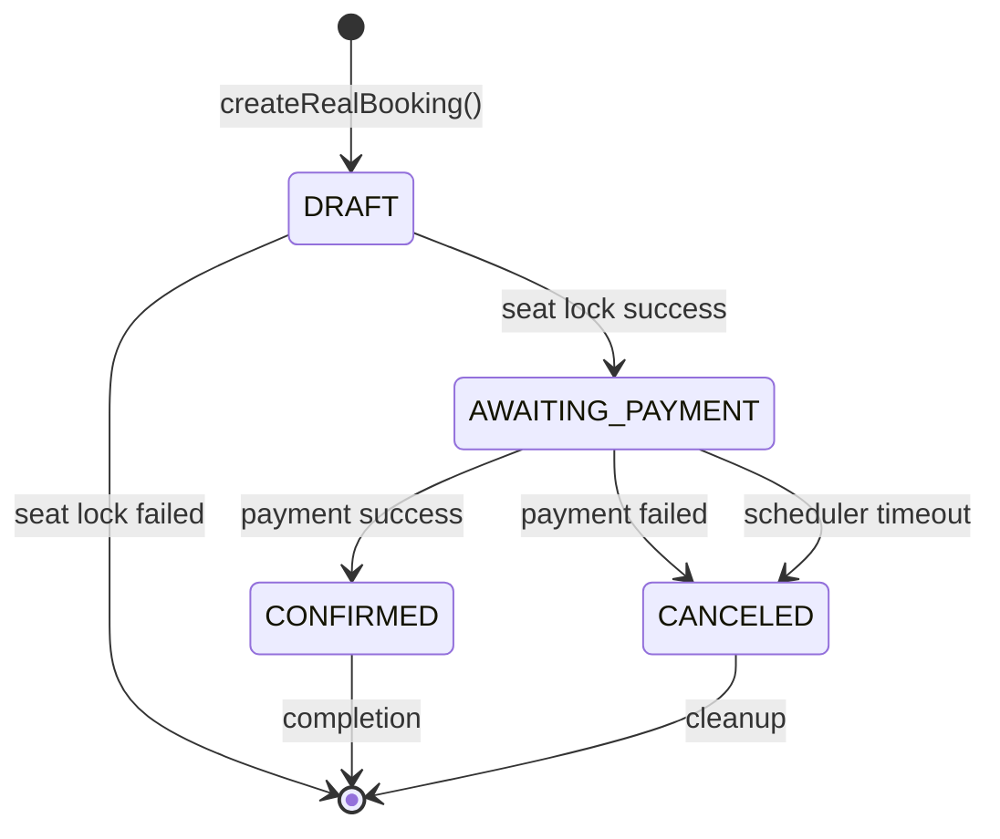
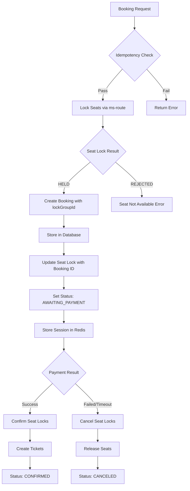
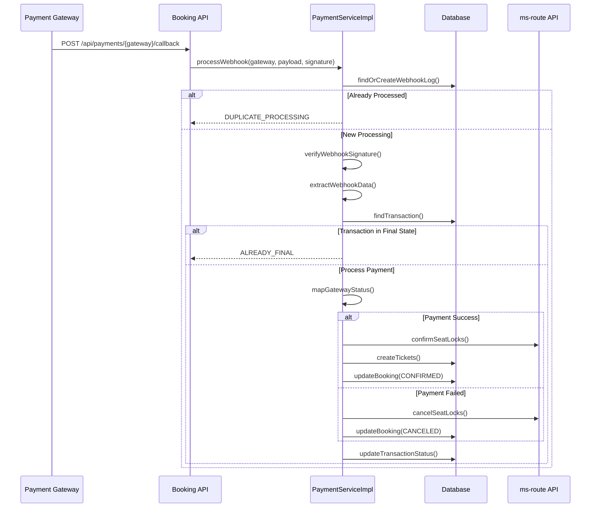

# Booking Payment Schedule Flow - MS Booking Service

## Overview
This document summarizes the complete booking payment schedule flow in the MS Booking microservice, including the recent fix for the lockGroupId issue and comprehensive flow diagrams.

## Architecture Components

### Core Services
- **BookingServiceImpl**: Main booking creation and management logic
- **BookingScheduler**: Scheduled tasks for expired booking cleanup
- **PaymentServiceImpl**: Payment processing and webhook handling
- **PricingService**: Price calculation and promotion management

### External Dependencies
- **ms-route API**: Seat lock management and trip information
- **Payment Gateways**: VNPay, MoMo, ZaloPay integration
- **Redis**: Session management and caching

## Complete Booking Flow



## Detailed Component Interactions

### Booking Creation States



### Seat Lock Management Flow



## Key Fixes Implemented

### LockGroupId Issue Resolution

**Problem**: The `BookingScheduler.handleExpiredBookings()` method was checking for `booking.getLockGroupId() != null` before canceling seat locks, but `BookingServiceImpl.createRealBooking()` wasn't setting this field.

**Solution**: Modified `createRealBooking()` to set `lockGroupId` using the idempotency key:

```java
// IMPORTANT: Set lockGroupId using idempotency key for proper seat lock management
String lockGroupId = req.getIdemKey();
if (lockGroupId != null && !lockGroupId.trim().isEmpty()) {
    b.setLockGroupId(lockGroupId);
    LOG.debug("Set lockGroupId {} for booking {} using idempotency key", lockGroupId, b.getBookingCode());
}
```

**Impact**: 
- ✅ Expired bookings now properly cancel seat locks
- ✅ Better resource management and cleanup
- ✅ Consistent with admin booking confirmation/cancellation flow

## Redis Key Structure

### Session Management
- `booking:sess:{bookingId}`: Booking session state (AWAITING_LOCK, AWAITING_PAYMENT)
- `booking:seats:{bookingId}`: Comma-separated seat numbers for the booking
- `idem:booking:{idemKey}`: Idempotency lock (60 seconds TTL)

### Payment Processing
- `payment:webhook:{transactionId}`: Webhook processing lock
- `booking:review:{bookingId}`: Manual review flag (7 days TTL)

## Scheduled Tasks

### BookingScheduler (Every Minute)
```java
@Scheduled(fixedRate = 60000) // Every minute
public void handleExpiredBookings() {
    // 1. Find expired AWAITING_PAYMENT bookings
    // 2. Cancel seat locks if lockGroupId exists (FIXED!)
    // 3. Update booking status to CANCELED
    // 4. Cleanup Redis sessions
    // 5. Mark for manual review on failures
}
```

### Reconciliation Task (Every 5 Minutes)
```java
@Scheduled(fixedRate = 300000) // Every 5 minutes
public void reconcileInconsistentStates() {
    // Find and fix inconsistent booking states
    // (Currently placeholder for future implementation)
}
```

## Payment Gateway Integration

### Supported Gateways
- **VNPay**: Vietnamese payment gateway with polling support
- **MoMo**: Mobile wallet integration
- **ZaloPay**: Zalo payment integration

### Webhook Processing Flow


## Error Handling & Recovery

### Seat Lock Failures
- **Creation Failure**: Rollback booking creation, cleanup Redis
- **Confirmation Failure**: Mark for manual review, attempt rollback
- **Cancellation Failure**: Log warning, continue with status update

### Payment Processing Failures
- **Webhook Verification Failed**: Return error response
- **Database Errors**: Mark for manual review
- **External API Failures**: Retry with exponential backoff

### Manual Review Process
- Bookings marked for manual review are stored in Redis
- Admin can review via `/api/admin/bookings/{id}/confirm` or `/cancel`
- Review entries expire after 7 days

## Performance Considerations

### Caching Strategy
- Pricing results cached to avoid repeated calculations
- Redis sessions with TTL for automatic cleanup
- Idempotency locks prevent duplicate processing

### Database Optimization
- Indexes on booking status, expiration time, customer ID
- Separate pricing snapshot table for historical data
- Optimized queries for expired booking detection

### External API Management
- Circuit breaker pattern for ms-route API calls
- Timeout configurations for payment gateway calls
- Retry logic with exponential backoff

## Monitoring & Observability

### Key Metrics
- Booking creation success/failure rates
- Payment processing times
- Seat lock cancellation success rates
- Expired booking cleanup performance

### Logging Strategy
- Structured logging with correlation IDs
- Different log levels for different operations
- Error tracking with stack traces for debugging

### Health Checks
- Database connectivity
- Redis connectivity
- External API availability
- Scheduled task execution status

## Security Considerations

### Idempotency
- Client-generated idempotency keys prevent duplicate bookings
- Redis-based locking with TTL prevents race conditions
- Webhook processing with duplicate detection

### Data Validation
- Input validation on all API endpoints
- Payment gateway signature verification
- Seat availability validation before booking

### Access Control
- Role-based access for admin operations
- API rate limiting for public endpoints
- Secure webhook endpoint with signature validation
