# Booking Payment Schedule Flow - MS Booking Service

## Overview
This document summarizes the complete booking payment schedule flow in the MS Booking microservice, including the recent fix for the lockGroupId issue and comprehensive flow diagrams.

## Architecture Components

### Core Services
- **BookingServiceImpl**: Main booking creation and management logic
- **BookingScheduler**: Scheduled tasks for expired booking cleanup
- **PaymentServiceImpl**: Payment processing and webhook handling
- **PricingService**: Price calculation and promotion management

### External Dependencies
- **ms-route API**: Seat lock management and trip information
- **Payment Gateways**: VNPay, MoMo, ZaloPay integration
- **Redis**: Session management and caching

## Complete Booking Flow

```mermaid
sequenceDiagram
    participant Client
    participant BookingAPI as Booking API
    participant BookingService as BookingServiceImpl
    participant PricingService as PricingService
    participant RouteAPI as ms-route API
    participant Redis
    participant Database
    participant PaymentGateway as Payment Gateway
    participant Scheduler as BookingScheduler

    Note over Client, Scheduler: 1. Booking Creation Flow
    Client->>BookingAPI: POST /api/bookings/draft
    BookingAPI->>BookingService: createRealBooking(req)
    
    Note right of BookingService: Idempotency Check
    BookingService->>Redis: setIfAbsent(idemKey)
    Redis-->>BookingService: LOCKED/EXISTS
    
    alt Idempotency Pass
        Note right of BookingService: 🎯 Step 1: Seat Validation Only
        BookingService->>RouteAPI: validateSeatsOnly(tripId, seats, idemKey)
        
        Note right of RouteAPI: ✅ Validates seat existence & duplicates
        RouteAPI-->>BookingService: VALIDATED/REJECTED
        
        alt Validation Success
            Note right of BookingService: 🎯 Step 2: Actual Seat Lock Attempt
            BookingService->>RouteAPI: tryLockSeats(lockRequest)
            RouteAPI-->>BookingService: SeatLockResponse(HELD/REJECTED)
            
            alt Seat Lock Success
                Note right of BookingService: 🎯 Step 3: Pricing Calculation
                BookingService->>PricingService: computePrice(tripId, seats, promoCode)
                PricingService-->>BookingService: PricingResult
                
                Note right of BookingService: Booking Creation
                BookingService->>Database: save(Booking) with lockGroupId
                Database-->>BookingService: Booking with ID
                
                BookingService->>Redis: store session & seats
                BookingService->>Database: save pricing snapshot
                BookingService->>Database: save applied promotions
                
                Note right of BookingService: Update Seat Lock
                BookingService->>RouteAPI: updateSeatLock(bookingId)
                BookingService->>Database: update status to AWAITING_PAYMENT
                
                BookingService-->>BookingAPI: BookingDraftResultVM
                BookingAPI-->>Client: 201 Created with booking details
            else Seat Lock Failed
                BookingService-->>BookingAPI: SeatNotAvailableException
                BookingAPI-->>Client: 409 Conflict
            end
        else Validation Failed
            BookingService-->>BookingAPI: SeatNotAvailableException
            BookingAPI-->>Client: 409 Conflict
        end
    else Idempotency Failed
        BookingService-->>BookingAPI: IllegalStateException
        BookingAPI-->>Client: 409 Conflict
    end

    Note over Client, Scheduler: 2. Payment Processing Flow
    Client->>PaymentGateway: Initiate Payment
    PaymentGateway-->>Client: Payment URL/QR
    
    Note over PaymentGateway, BookingService: Payment Completion
    PaymentGateway->>BookingAPI: Webhook callback
    BookingAPI->>PaymentServiceImpl: processWebhook()
    
    PaymentServiceImpl->>Database: find transaction & booking
    PaymentServiceImpl->>PaymentServiceImpl: validate & process payment
    
    alt Payment Success
        PaymentServiceImpl->>RouteAPI: confirmSeatLocks()
        PaymentServiceImpl->>Database: create tickets
        PaymentServiceImpl->>Database: update booking to CONFIRMED
        PaymentServiceImpl->>Redis: cleanup session
    else Payment Failed
        PaymentServiceImpl->>RouteAPI: cancelSeatLocks()
        PaymentServiceImpl->>Database: update booking to CANCELED
        PaymentServiceImpl->>Redis: cleanup session
    end

    Note over Client, Scheduler: 3. Scheduled Cleanup Flow (Every Minute)
    Scheduler->>Database: findExpiredAwaitingPaymentBookings()
    
    loop For Each Expired Booking
        Note right of Scheduler: Seat Lock Cleanup (Fixed!)
        alt lockGroupId exists (Now works with fix)
            Scheduler->>RouteAPI: cancelSeatLocks()
            Scheduler->>Database: update status to CANCELED
            Scheduler->>Redis: delete session & seat data
        else lockGroupId missing (Before fix)
            Scheduler-->>Scheduler: Skip seat lock cancellation
            Scheduler->>Database: update status to CANCELED
            Scheduler->>Redis: delete session & seat data
            Note right of Scheduler: ⚠️ Seat locks remain locked!
        end
    end
```



## Detailed Component Interactions

### Booking Creation States


### Seat Lock Management Flow


## Seat Validation Strategy

### Architectural Analysis: Where Should Seat Validation Be?

This is a critical architectural decision that impacts performance, data consistency, and system design. Let's analyze the current approach versus ideal patterns.

#### Current Implementation: **Mixed Responsibility**

| Component | Validation Type | Pros | Cons |
|-----------|-----------------|------|------|
| **Booking MS (PricingService)** | Seat existence + current lock check | Early fail-fast, pricing integration | Duplicate logic, tight coupling |
| **Route MS (tryLockSeats)** | Atomic seat lock | Single source of truth, race-condition proof | Network dependency, late failure |

#### Recommended Architecture: **Route-First Validation**

```mermaid
sequenceDiagram
    participant Client
    participant BookingAPI as Booking API
    participant RouteAPI as Route API
    participant BookingService as Booking Service
    participant PricingService as Pricing Service
    
    Note over Client, PricingService: 🎯 Current Flow: Route-First Validation
    Client->>BookingAPI: POST /api/bookings/draft
    BookingAPI->>RouteAPI: validateSeatsOnly(tripId, seats, idemKey)
    
    Note right of RouteAPI: ✅ Single Source of Truth for Validation
    RouteAPI->>RouteAPI: Validate seat existence
    RouteAPI->>RouteAPI: Check for duplicates
    RouteAPI-->>BookingAPI: VALIDATED/REJECTED
    
    alt Validation Success
        BookingAPI->>RouteAPI: tryLockSeats(lockRequest)
        Note right of RouteAPI: Atomic seat lock
        RouteAPI-->>BookingAPI: SeatLockResponse(HELD/REJECTED)
        
        alt Lock Success
            BookingAPI->>PricingService: computePrice(tripId, seats, promoCode)
            PricingService-->>BookingAPI: Final pricing
            BookingAPI->>BookingService: createBooking()
            BookingService-->>BookingAPI: Booking created
        else Lock Failed
            RouteAPI-->>BookingAPI: SeatNotAvailableException
            BookingAPI-->>Client: 409 Conflict
        end
    else Validation Failed
        RouteAPI-->>BookingAPI: SeatNotAvailableException
        BookingAPI-->>Client: 409 Conflict
    end
```



#### Comparison: Current vs Recommended

| Aspect | Current Approach | Recommended Approach |
|--------|------------------|---------------------|
| **Single Source of Truth** | ❌ Distributed across services | ✅ Route MS owns seat state |
| **Network Calls** | 2-3 calls (trip detail + lock) | 1 call (validate + lock) |
| **Race Conditions** | ⚠️ Possible between check & lock | ✅ Atomic operation |
| **Code Duplication** | ❌ Seat logic in both services | ✅ Centralized in Route MS |
| **Performance** | ⚠️ Multiple API calls | ✅ Single optimized call |
| **Error Consistency** | ❌ Different error types/messages | ✅ Consistent error handling |

#### Proposed Route MS API Enhancement

```java
// New endpoint in Route MS
POST /api/routes/trips/{tripId}/seats/validate-lock
{
    "seatNumbers": ["A1", "A2"],
    "idemKey": "unique-key-123",
    "promoCode": "DISCOUNT10" // optional
}

// Response
{
    "status": "HELD",
    "lockGroupId": "unique-key-123",
    "pricing": {
        "baseFare": 50.00,
        "finalPrice": 45.00,
        "appliedPromotion": {...}
    },
    "expiresAt": "2025-10-11T21:20:00Z"
}
```

#### Migration Strategy

**Phase 1: Immediate (Current System)**
```java
// Keep current approach but add documentation
// Acknowledge this is temporary solution
```

**Phase 2: Short-term (Enhanced Route MS)**
```java
// Add new validate-lock endpoint to Route MS
// Booking MS calls new endpoint
// Keep old logic as fallback
```

**Phase 3: Long-term (Optimized)**
```java
// Remove seat validation from Booking MS
// Route MS becomes single source of truth
// Simplified Booking MS logic
```

### Current Two-Level Validation Approach

The booking system currently implements a **two-level seat validation** strategy to ensure seat availability and prevent double bookings:

#### Level 1: Pricing Service Validation (Pre-Lock Check)
```java
// In PricingService.computePrice()
TripDetailVM tripVM = tripResourceMsrouteApi.getTripDetail(tripId);

// Validate seat existence & current locks
if (tripVM.getSeatLockDTOs() != null && !tripVM.getSeatLockDTOs().isEmpty()) {
    Set<String> taken = tripVM.getSeatLockDTOs().stream()
            .filter(l -> eqAnyIgnoreCase(l.getStatus(), "HELD", "COMMITTED"))
            .map(SeatLockDTO::getSeatNo)
            .collect(Collectors.toSet());
    for (String s : seatNos) {
        if (taken.contains(s))
            throw new IllegalStateException("Seat " + s + " is not available");
    }
}

// Validate seat exists in trip structure
Map<String, SeatDTO> seatByNo = new HashMap<>();
tripVM.getDetailVM().getSeatsByFloorId().forEach((floorIdStr, seats) -> {
    seats.forEach(s -> seatByNo.put(s.getSeatNo(), s));
});

for (String seatNo : seatNos) {
    SeatDTO seat = seatByNo.get(seatNo);
    if (seat == null)
        throw new IllegalArgumentException("Unknown seat number: " + seatNo);
}
```

#### Level 2: Seat Lock API Validation (Atomic Lock)
```java
// In BookingServiceImpl.createRealBooking()
SeatLockRequestDTO lockRequest = new SeatLockRequestDTO();
lockRequest.setTripId(req.getTripId());
lockRequest.setSeatNumbers(req.getSeats());
lockRequest.setIdemKey(req.getIdemKey());

var lockResult = seatLockResourceMsrouteApi.tryLockSeats(lockRequest);

if (!isHeld(lockResult)) {
    throw new SeatNotAvailableException("Seat not available: " + lockResult.getMessage());
}
```

### Booking Method Differences: Why Draft vs Real Booking Have Different Validation

#### **Core Design Principle**
The system implements two distinct booking approaches based on user intent:

| Method | Seat Validation | Seat Holding | Database Operations | Use Case | Performance |
|--------|----------------|--------------|-------------------|----------|-------------|
| **createSimpleDraft()** | ❌ No validation | ❌ No holding | ❌ No persistence | **Price inquiry only** | ⚡ Fast |
| **createRealBooking()** | ✅ Both levels | ✅ Atomic lock | ✅ Full persistence | **Actual reservation** | 🛡️ Reliable |

#### **Why This Separation Makes Sense**

**Draft Flow (`createSimpleDraft`)**
- **Purpose**: Users exploring pricing options without commitment
- **No Resource Impact**: Seats aren't limited resources during price exploration
- **Performance Priority**: Fast response times for better user experience
- **Business Logic**: No need to validate/hold seats for what might be just browsing

**Real Booking Flow (`createRealBooking`)**
- **Purpose**: Users committing to purchase limited resources
- **Resource Management**: Seats are valuable, limited assets that must be protected
- **Data Integrity**: Prevent double bookings and race conditions
- **Business Logic**: Can't sell already booked seats to multiple customers

#### createSimpleDraft() Flow


**Key Characteristics:**
- ⚡ **Fast**: No external API calls to Route MS
- 💰 **Cost-effective**: No resource consumption
- 🔍 **Exploratory**: Users can check multiple scenarios
- 📊 **Pricing-focused**: Only concerned with cost calculation

#### createRealBooking() Flow


**Key Characteristics:**
- 🛡️ **Reliable**: Two-level validation prevents issues
- 🔒 **Resource-aware**: Holds seats to prevent double booking
- 💾 **Persistent**: Creates actual booking records
- 🔄 **Transactional**: Ensures data consistency

#### **Real-World Analogy**
- **Draft**: Like browsing a hotel website to check room prices
- **Real Booking**: Like actually booking a room and getting a confirmation number

#### **Performance vs Reliability Trade-off**

| Aspect | Draft (Performance) | Real Booking (Reliability) |
|--------|---------------------|----------------------------|
| **Response Time** | ~50ms | ~200-500ms |
| **Resource Usage** | Minimal | Seat locks + DB writes |
| **User Experience** | Instant price feedback | Confirmed reservation |
| **Business Impact** | None | Actual revenue transaction |

### Seat Validation Benefits

1. **Early Fail Fast**: Pricing service validation catches invalid seats quickly
2. **Race Condition Prevention**: Atomic seat lock API prevents double booking
3. **Data Integrity**: Both validation levels ensure data consistency
4. **Performance**: Simple draft method avoids expensive operations when only pricing is needed

### Error Handling

| Validation Level | Error Type | HTTP Status | User Message |
|------------------|------------|-------------|--------------|
| Pricing Service | `IllegalArgumentException` | 400 Bad Request | "Unknown seat number: X" |
| Pricing Service | `IllegalStateException` | 409 Conflict | "Seat X is not available" |
| Seat Lock API | `SeatNotAvailableException` | 409 Conflict | "Seat not available: [reason]" |

## Key Fixes Implemented

### LockGroupId Issue Resolution

**Problem**: The `BookingScheduler.handleExpiredBookings()` method was checking for `booking.getLockGroupId() != null` before canceling seat locks, but `BookingServiceImpl.createRealBooking()` wasn't setting this field.

**Solution**: Modified `createRealBooking()` to set `lockGroupId` using the idempotency key:

```java
// IMPORTANT: Set lockGroupId using idempotency key for proper seat lock management
String lockGroupId = req.getIdemKey();
if (lockGroupId != null && !lockGroupId.trim().isEmpty()) {
    b.setLockGroupId(lockGroupId);
    LOG.debug("Set lockGroupId {} for booking {} using idempotency key", lockGroupId, b.getBookingCode());
}
```

**Impact**: 
- ✅ Expired bookings now properly cancel seat locks
- ✅ Better resource management and cleanup
- ✅ Consistent with admin booking confirmation/cancellation flow

## Redis Key Structure

### Session Management
- `booking:sess:{bookingId}`: Booking session state (AWAITING_LOCK, AWAITING_PAYMENT)
- `booking:seats:{bookingId}`: Comma-separated seat numbers for the booking
- `idem:booking:{idemKey}`: Idempotency lock (60 seconds TTL)

### Payment Processing
- `payment:webhook:{transactionId}`: Webhook processing lock
- `booking:review:{bookingId}`: Manual review flag (7 days TTL)

## Scheduled Tasks

### BookingScheduler (Every Minute)
```java
@Scheduled(fixedRate = 60000) // Every minute
public void handleExpiredBookings() {
    // 1. Find expired AWAITING_PAYMENT bookings
    // 2. Cancel seat locks if lockGroupId exists (FIXED!)
    // 3. Update booking status to CANCELED
    // 4. Cleanup Redis sessions
    // 5. Mark for manual review on failures
}
```

### Reconciliation Task (Every 5 Minutes)
```java
@Scheduled(fixedRate = 300000) // Every 5 minutes
public void reconcileInconsistentStates() {
    // Find and fix inconsistent booking states
    // (Currently placeholder for future implementation)
}
```

## Payment Gateway Integration

### Supported Gateways
- **VNPay**: Vietnamese payment gateway with polling support
- **MoMo**: Mobile wallet integration
- **ZaloPay**: Zalo payment integration

### Webhook Processing Flow


## Error Handling & Recovery

### Seat Lock Failures
- **Creation Failure**: Rollback booking creation, cleanup Redis
- **Confirmation Failure**: Mark for manual review, attempt rollback
- **Cancellation Failure**: Log warning, continue with status update

### Payment Processing Failures
- **Webhook Verification Failed**: Return error response
- **Database Errors**: Mark for manual review
- **External API Failures**: Retry with exponential backoff

### Manual Review Process
- Bookings marked for manual review are stored in Redis
- Admin can review via `/api/admin/bookings/{id}/confirm` or `/cancel`
- Review entries expire after 7 days

## Performance Considerations

### Caching Strategy
- Pricing results cached to avoid repeated calculations
- Redis sessions with TTL for automatic cleanup
- Idempotency locks prevent duplicate processing

### Database Optimization
- Indexes on booking status, expiration time, customer ID
- Separate pricing snapshot table for historical data
- Optimized queries for expired booking detection

### External API Management
- Circuit breaker pattern for ms-route API calls
- Timeout configurations for payment gateway calls
- Retry logic with exponential backoff

## Monitoring & Observability

### Key Metrics
- Booking creation success/failure rates
- Payment processing times
- Seat lock cancellation success rates
- Expired booking cleanup performance

### Logging Strategy
- Structured logging with correlation IDs
- Different log levels for different operations
- Error tracking with stack traces for debugging

### Health Checks
- Database connectivity
- Redis connectivity
- External API availability
- Scheduled task execution status

## Security Considerations

### Idempotency
- Client-generated idempotency keys prevent duplicate bookings
- Redis-based locking with TTL prevents race conditions
- Webhook processing with duplicate detection

### Data Validation
- Input validation on all API endpoints
- Payment gateway signature verification
- Seat availability validation before booking

### Access Control
- Role-based access for admin operations
- API rate limiting for public endpoints
- Secure webhook endpoint with signature validation
