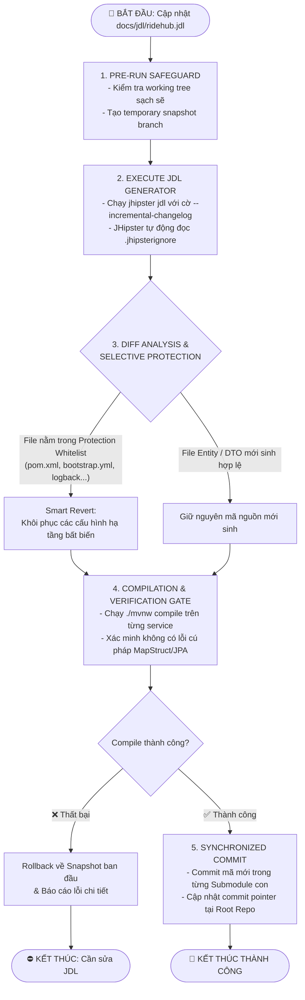

# KẾ HOẠCH QUY TRÌNH TỰ ĐỘNG HÓA SINH MÃ JDL & BẢO VỆ CẤU HÌNH (JDL SYNC & SELECTIVE REVERT FLOW PLAN)

> **Mục tiêu**: Xóa bỏ hoàn toàn các script chắp vá thủ công trước đây (`git-restore.sh`, `cleanup_changelogs.sh`, `copy_specific_files.sh`), thay thế bằng một **Quy trình chuẩn hóa (Pipeline Flow Plan)** nhằm đảm bảo việc cập nhật schema từ `docs/jdl/ridehub.jdl` diễn ra an toàn, tự động khôi phục các tệp cấu hình cốt lõi mà không làm gián đoạn hệ thống microservices.

---

## 1. Vấn đề của cơ chế cũ (Legacy Pitfalls)

Trước đây, sau mỗi lần chạy `jhipster jdl`, JHipster thường tự ý ghi đè:
- `pom.xml` (xóa mất cấu hình repo Reposilite và thư viện `ridehub-shared`).
- `bootstrap.yml` & `application-*.yml` (xóa mất cấu hình Consul KV & Vault qua HTTPS).
- `logback-spring.xml` (xóa cấu hình log tập trung).
- Cấu hình bảo mật và Kafka broker.

Cách giải quyết cũ là chạy một script `git-restore.sh` để `git restore` mù quáng một danh sách file cứng. Cách này tiềm ẩn rủi ro lớn:
- Nếu JDL có nâng cấp dependency hoặc bổ sung thuộc tính hợp lệ, lệnh restore sẽ xoá sạch cả những cập nhật mới cần thiết.
- Dễ gây ra hiện tượng không đồng bộ giữa Liquibase changelog và Entity Java.
- Khó kiểm soát khi hệ thống mở rộng nhiều microservices.

---

## 2. Sơ đồ luồng chuẩn hóa (Standard Automation Flow)

Dưới đây là thiết kế luồng quy trình (Flow Plan) chuẩn mực để thực hiện việc sinh mã từ JDL và bảo vệ cấu hình:



---

## 3. Chi tiết các giai đoạn trong Kế hoạch (Phase Breakdown)

### Phase 1: Pre-run Safeguard (Bảo vệ tiền khởi chạy)
* **Kiểm tra trạng thái**: Đảm bảo toàn bộ 10 submodules không có uncommitted changes dở dang.
* **Tạo điểm phục hồi**: Tự động tạo git tag hoặc branch tạm (ví dụ: `backup/pre-jdl-<timestamp>`) trên từng submodule để có thể rollback 100% nếu có sự cố.

### Phase 2: Execute JDL Generator (Thực thi sinh mã có kiểm soát)
* Chạy JHipster với các tham số an toàn:
  ```bash
  jhipster jdl docs/jdl/ridehub.jdl --monorepository --incremental-changelog --skip-git
  ```
* JHipster tự động đọc các file `.jhipsterignore` tại từng submodule để bỏ qua các class nghiệp vụ đã được đánh dấu.

### Phase 3: Selective Protection Whitelist (Khôi phục cấu hình chọn lọc)
Thay vì restore thủ công, hệ thống áp dụng danh sách Whitelist các tệp cấu hình cốt lõi cần giữ nguyên trạng từ `HEAD`:
* **Maven dependencies**: `pom.xml` (Bảo vệ thông tin repo Reposilite `https://repo.phungvip.io.vn` và dependency `ridehub-shared`).
* **Consul & Vault Bootstrap**: `src/main/resources/config/bootstrap*.yml` (Bảo vệ cấu hình HTTPS/FQDN đa VPS).
* **Logging**: `src/main/resources/logback-spring.xml`.
* **Broker & Security Config**: Các lớp tích hợp hạ tầng không do JDL sinh.

### Phase 4: Compilation & Verification Gate (Cổng kiểm thử tự động)
* Trước khi chấp nhận bất kỳ thay đổi nào, một vòng lặp kiểm thử độc lập sẽ chạy trên từng submodule:
  ```bash
  cd backend/<service>
  ./mvnw clean compile -DskipTests
  ```
* Nếu một microservice gặp lỗi (ví dụ: sai kiểu dữ liệu giữa DTO và Entity), pipeline lập tức dừng lại và kích hoạt cơ chế Rollback về snapshot ở Phase 1.

### Phase 5: Synchronized Commit (Đồng bộ Submodules chuẩn chỉ)
* Commit các thay đổi hợp lệ trong từng submodule con trước với thông điệp chuẩn:
  `chore(jdl): sync entities from ridehub.jdl [skip ci]`
* Quay về thư mục gốc để commit các con trỏ submodule mới (submodule commit pointers).

---

## 4. Kế hoạch triển khai thành công cụ tương lai (Automation Tooling)

Kế hoạch sẽ được hiện thực hóa bằng một script thống nhất hoặc GitHub Actions workflow:
- **Tên dự kiến**: `sync-jdl.sh` (đặt tại `docs/script/sync-jdl.sh` hoặc CLI root).
- **Tính năng**:
  - Hỗ trợ cờ `--dry-run`: Xem trước các file sẽ bị thay đổi mà không ghi đè.
  - Hỗ trợ cờ `--service <name>`: Chỉ sinh mã và bảo vệ cho 1 service chỉ định.
  - Tự động thực hiện 5 Phase trên mà không cần sự can thiệp thủ công của con người.
