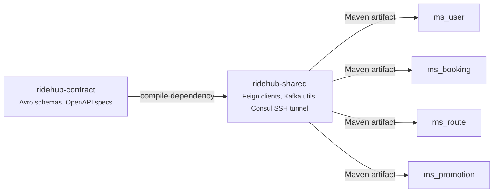

# RideHub Shared Modules

Thư mục này chứa 2 module dùng chung cho toàn bộ hệ thống microservices RideHub.

```
shared/
├── ridehub-contract/   ← Schema & Contract definitions (SSOT)
└── ridehub-shared/     ← Spring Boot Auto-Configuration Library
```

---

## Mối quan hệ giữa 2 module



- **`ridehub-contract`** là nguồn sự thật duy nhất (SSOT) cho tất cả schema/contract
- **`ridehub-shared`** consume contract từ `ridehub-contract`, đóng gói thành library cho microservices
- Các microservice **chỉ cần depend vào `ridehub-shared`** — contract được kéo vào transitively

---

## 1. ridehub-contract

> **Vai trò**: Định nghĩa tất cả schema và contract giao tiếp giữa các microservice.

| Thuộc tính | Giá trị |
|---|---|
| **Group ID** | `com.ridehub` |
| **Artifact ID** | `ridehub-contract` |
| **Version** | `0.1.0-SNAPSHOT` |
| **Java** | 17 |
| **Publish** | GitHub Packages |

### Contract đã định nghĩa

#### Avro Schemas (`src/main/avro/`)
- **`common/EventEnvelope.avsc`** — Schema envelope chung cho tất cả Kafka event
  - `eventName` (string) — Tên event domain (vd: `BOOKING_CREATED`, `TICKET_CONFIRMED`)
  - `payload` (nullable string) — Business data serialize dưới dạng JSON string
  - `payloadType` (nullable string) — Fully qualified class name để deserialize payload

#### OpenAPI Specs (`src/main/openapi/`)
- **`booking-api.yaml`** — REST API specs cho `ms_booking` (bookings, tickets, payments)
- **`user-api.yaml`** — REST API specs cho `ms_user` (app-users, profiles, otp auth)
- **`route-api.yaml`** — REST API specs cho `ms_route` (routes, trips, seat locks)
- **`promotion-api.yaml`** — REST API specs cho `ms_promotion` (promotions, policies)

#### AsyncAPI (`src/main/asyncapi/`)
- **`ridehub-events.yaml`** — AsyncAPI 3.0 specification định nghĩa các channels (`msbooking.events`, `msuser.events`, `msroute.events`, `mspromotion.events`), operations, và message schemas cho toàn bộ hệ thống Kafka.

#### JSON Schemas (`src/main/json-schema/`)
- **`common/audit-fields.json`** — Audit fields chung (`createdAt`, `updatedAt`, `isDeleted`, `deletedAt`, `deletedBy`)
- **`events/event-envelope.json`** — JSON Schema mô tả cấu trúc envelope sự kiện
- **`events/booking-event-payload.json`** — Schema cho payload sự kiện booking
- **`events/user-event-payload.json`** — Schema cho payload sự kiện user
- **`events/route-event-payload.json`** — Schema cho payload sự kiện route
- **`events/promotion-event-payload.json`** — Schema cho payload sự kiện promotion

#### Examples & Validation (`examples/`, `contract-tests/`)
- **`examples/events/*.json`** — Các mẫu payload envelope hoàn chỉnh cho các sự kiện
- **`contract-tests/validate-schemas.sh`** — Test script tự động kiểm tra cú pháp và tính hợp lệ của tất cả schema, OpenAPI, AsyncAPI và JSON ví dụ.

### Build

```bash
cd infra/shared/ridehub-contract
./mvnw clean package        # Build JAR + generate Avro Java classes
./mvnw clean install        # Install vào local Maven repo
```

Avro classes được **auto-generate** lúc build (`generate-sources` phase) vào `target/generated-sources/avro/`. Không có Java source code nào được viết tay.

### Publish

Tag theo format `v*.*.*` để trigger GitHub Actions workflow:

```bash
git tag -a v0.1.0 -m "Release 0.1.0"
git push origin v0.1.0
```

---

## 2. ridehub-shared

> **Vai trò**: Spring Boot 3 Auto-Configuration Library cung cấp Feign clients, Kafka utilities, và Consul SSH tunnel cho các microservice.

| Thuộc tính | Giá trị |
|---|---|
| **Group ID** | `com.ridehub.clients` |
| **Artifact ID** | `client-open-feign-avro` |
| **Version** | `0.1.0` (POM) / `v2.2.x` (Git tags) |
| **Java** | 17 |
| **Spring Boot** | 3.4.4 |
| **Spring Cloud** | 2024.0.1 |
| **Publish** | GitHub Packages |

### Chức năng chính

#### A. OpenFeign Clients (auto-generated)

Pre-generated Feign client interfaces cho 4 microservice:

| Service | APIs | Models | Ví dụ |
|---|---|---|---|
| **msbooking** | 16 interfaces | 33 DTOs | `BookingResourceMsbookingApi`, `TicketDTO` |
| **mspromotion** | 12 interfaces | 13 DTOs | `PromotionResourceMspromotionApi`, `BuyNGetMFreeDTO` |
| **msroute** | 23 interfaces | 52 DTOs | `TripResourceMsrouteApi`, `RouteDTO`, `SeatDTO` |
| **msuser** | 12 interfaces | 26 DTOs | `AppUserResourceMsuserApi`, `ProfileDTO` |

**Tự động đăng ký** — Tất cả `*Api` interfaces được auto-scan và register thành Spring beans qua `RidehubFeignAutoConfiguration`. Microservice chỉ cần `@Autowired`:

```java
@Service
public class BookingService {
    private final TripResourceMsrouteApi tripApi;
    private final SeatLockResourceMsrouteApi seatLockApi;

    public BookingService(TripResourceMsrouteApi tripApi,
                          SeatLockResourceMsrouteApi seatLockApi) {
        this.tripApi = tripApi;
        this.seatLockApi = seatLockApi;
    }
}
```

**Authentication tự động** — Mỗi Feign call tự động gắn JWT token:
1. Nếu có user context → forward user's JWT (token passthrough)
2. Nếu không có → tự lấy service token từ Keycloak (`client_credentials` grant)

#### B. Kafka Event Utilities

Cung cấp framework produce/consume Kafka events dùng Spring Cloud Stream + Avro:

**Producer** — Extend `GenericKafkaProducer`:
```java
@Component("kafkaProducer")
public class KafkaProducer extends GenericKafkaProducer {
    // Gọi: send("BOOKING_CREATED", bookingDTO, bookingId)
}
```

**Consumer** — Extend `GenericKafkaConsumer` + implement `EventHandler<T>`:
```java
@Component("kafkaConsumer")
public class KafkaConsumer extends GenericKafkaConsumer {
    public KafkaConsumer(KafkaUtilityService utilityService) {
        super(utilityService);
    }
}

@Component
public class BookingCreatedHandler implements EventHandler<BookingDTO> {
    @Override
    public String getEventName() { return "BOOKING_CREATED"; }

    @Override
    public void handle(BookingDTO payload) {
        // Business logic xử lý event
    }
}
```

**Các component Kafka chính:**

| Class | Vai trò |
|---|---|
| `GenericKafkaProducer` | Base class producer, quản lý gửi `EventEnvelope` qua Spring Cloud Stream |
| `GenericKafkaConsumer` | Base class consumer, nhận `EventEnvelope` và dispatch |
| `EventDispatcher` | Map `eventName` → `EventHandler` bean, tự deserialize payload |
| `KafkaUtilityService` | Orchestrator: convert Avro ↔ POJO, dispatch events, SSE broadcast |
| `KafkaJobRunner` | Thread pool cho async consumer jobs |
| `AvroConverter` | Utility convert Java objects ↔ Avro `EventEnvelope` |

#### C. Consul SSH Tunnel (Dev Profile)

Cho phép local dev machine đăng ký service lên remote Consul (VPS) thông qua SSH reverse tunnel:

```yaml
# application-dev.yml trong microservice
tunnel:
  enabled: true
  vps-host: phungvip.io.vn
  vps-user: deploy
  vps-password: ${VPS_SSH_PASSWORD}
  port-offset: 1000
```

Tự động:
1. Mở SSH tunnel `localhost:port` → `vps:port+1000`
2. Đăng ký service trên Consul với VPS address
3. Thêm suffix `-dev` vào service name/ID

### Spring Boot Auto-Configurations

Registered trong `META-INF/spring/org.springframework.boot.autoconfigure.AutoConfiguration.imports`:

| Auto-Configuration | Điều kiện | Chức năng |
|---|---|---|
| `KafkaLibraryAutoConfiguration` | Luôn active | ObjectMapper, RetryTemplate, EventDispatcher, KafkaUtilityService beans |
| `RidehubFeignAutoConfiguration` | `Feign.class` + `LoadBalancerClient.class` trên classpath | Feign encoder/decoder, auth interceptor, client auto-registration |
| `ConsulSSHTunnelAutoConfiguration` | `@ConditionalOnConsulEnabled` + `tunnel.enabled=true` | SSH tunnel + Consul registration customizer |

### Cách microservice sử dụng

**1. Thêm dependency:**
```xml
<dependency>
    <groupId>com.ridehub.clients</groupId>
    <artifactId>client-open-feign-avro</artifactId>
    <version>1.0.0</version>
</dependency>
```

**2. Thêm repository (nếu chưa có):**
```xml
<repository>
    <id>github</id>
    <url>https://maven.pkg.github.com/phungle-vip/ridehub-shared</url>
</repository>
```

**3. Cấu hình properties:**
```yaml
ridehub:
  feign:
    token-url: https://keycloak.phungvip.io.vn/realms/jhipster/protocol/openid-connect/token
    client-id: ${SERVICE_NAME}
    client-secret: ${KEYCLOAK_CLIENT_SECRET}
    scope: internal

kafka:
  utility:
    enabled: true
    service-name: ${SERVICE_NAME}
```

### OpenAPI Client Generation Pipeline

Chạy khi cần re-generate Feign clients (sau khi API endpoints thay đổi):

```bash
cd infra/shared/ridehub-shared
./mvnw clean package -Prun-openapi
```

Pipeline:
1. `fetch-token.sh` → Lấy Keycloak access token
2. `consul-download-openapis.sh` → Query Consul, download OpenAPI specs từ các service qua Gateway
3. `generate-clients.sh` → Dùng `openapi-generator-cli 7.14.0` generate Feign client interfaces

> **Yêu cầu**: Tất cả microservice phải đang chạy và registered trong Consul.

### Build & Publish

```bash
# Build
./mvnw clean package -DskipTests

# Build + re-generate clients (yêu cầu services đang chạy)
./mvnw clean package -Prun-openapi -DskipTests

# Publish (triggered by git tag)
git tag -a v2.2.9 -m "Release 2.2.9"
git push origin v2.2.9
```

---

## Microservice nào dùng gì?

| Microservice | Feign Clients Used | Kafka | Consul Tunnel |
|---|---|---|---|
| **ms_booking** | `SeatLockResourceMsrouteApi`, `TripResourceMsrouteApi`, `PricingTemplateResourceMsrouteApi`, `PromotionResourceMspromotionApi` | ✅ Producer + Consumer | ✅ |
| **ms_user** | `ChatbotTripSearchResourceMsrouteApi` | ✅ Producer + Consumer | ✅ |
| **ms_route** | Không dùng (là provider) | ✅ Producer + Consumer | ✅ |
| **ms_promotion** | Không dùng (là provider) | ✅ Producer + Consumer | ✅ |
| **gateway** | Không dùng | ❌ | ❌ |

